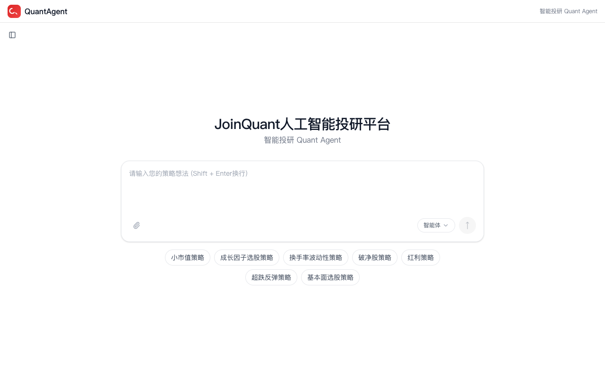
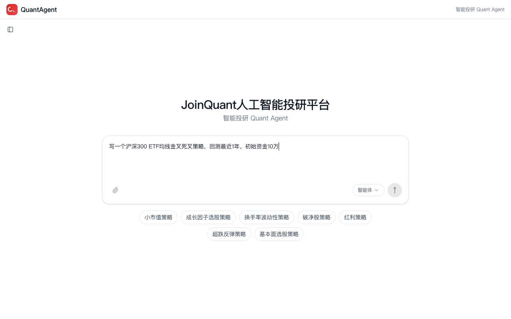
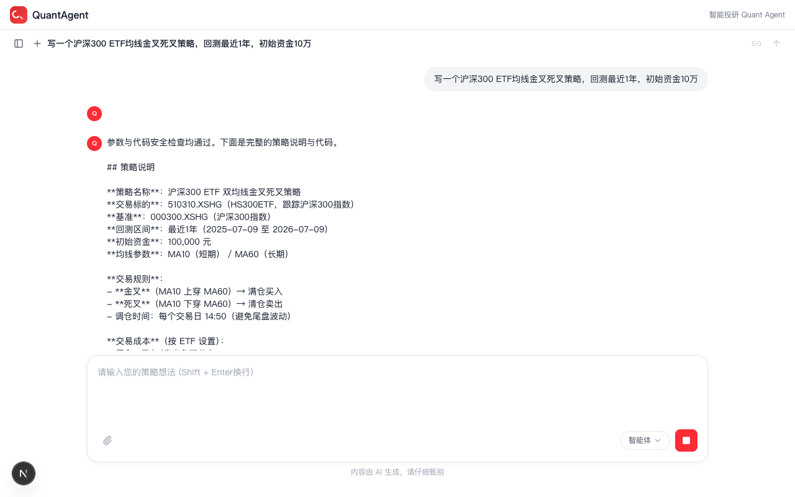
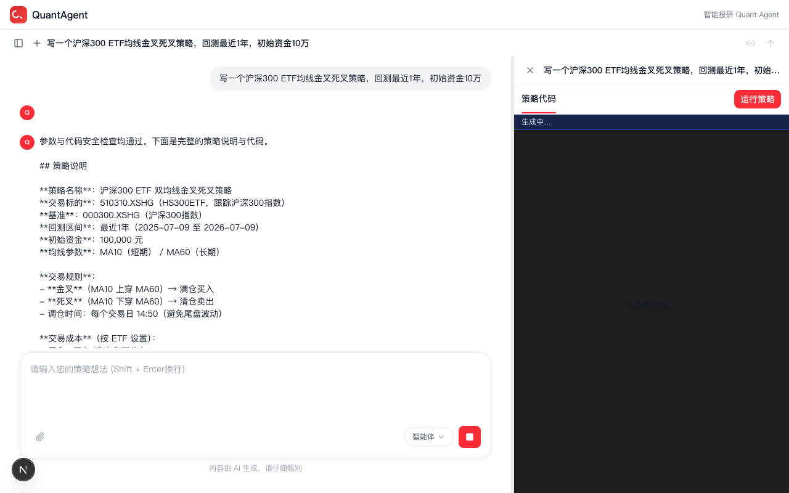
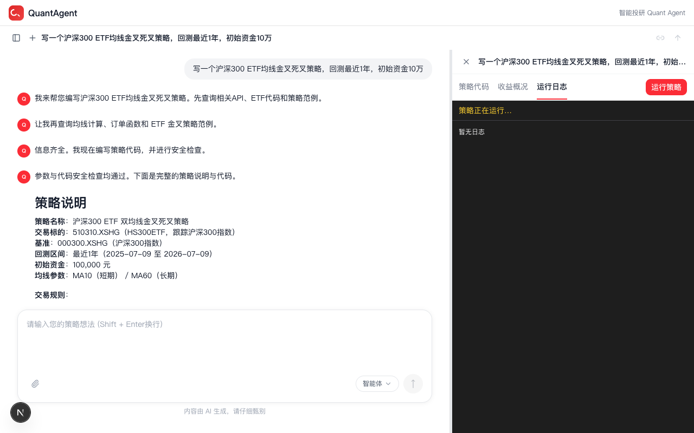

# Quant Agent

基于 LangGraph 与 FastAPI 的量化投研对话平台。通过自然语言对话完成市场分析、策略编写、回测执行与改进建议。

## Demo（真实链路、零 mock）

下面 5 张截图由 `pnpm demo:capture`（脚本位于 `frontend/e2e/demo-capture.mjs`）驱动 — headless Chrome + 真实后端 + 真实 LLM + 真实聚宽 `jqcli` 回测，无任何 mock / 假数据。脚本用 `puppeteer` 的 `page.screenshot()` 在浏览器的内部视口里抓帧，桌面其它窗口不会被扫到。

| # | 截图 | 阶段 | 对应 spec |
| - | ---- | ---- | ---------- |
| 01 |  | 工作区首页，QuantAgent 输入框 + 4 个示例 chip | F1 入口 |
| 02 |  | 自然语言策略描述已填入（"写一个沪深300 ETF 均线金叉死叉策略，回测最近1年，初始资金10万"） | F1 输入 |
| 03 |  | LLM 流式回复完成，聊天流里弹出"策略代码"卡片（点开后是 Monaco 编辑器的 Python 策略）| F1 产出 |
| 04 |  | 打开代码卡片后的 split-pane 策略工作区，右栏可继续编辑/触发回测 | F1 二次编辑 |
| 05 |  | "运行策略" 已点击，后端 `POST /api/v1/backtest` 200 + jqcli 回测 stream 拉起 | F2 回测 |

刷新截图：

```bash
cd frontend
pnpm demo:capture         # 5 张图写到 frontend/public/screenshots/
```

> ⚠️ 需要后端可达（`BACKEND_URL` 默认 `http://localhost:8000`）+ 可访问的 LLM + 已配置的 `JQCLI_USERNAME/JQCLI_PASSWORD`，跑一次 ≈ 60–120s。

## 功能特性

- **多轮对话** — 基于 LangGraph 的 Agent 编排引擎，支持上下文记忆与多步推理
- **流式响应** — 实时 SSE 推送，逐 token 输出，支持自动重连
- **会话管理** — 创建/列表/删除对话，自动标题生成
- **用户认证** — JWT Cookie 认证，首次部署引导式管理账号设置
- **中间件管道** — 可扩展的中间件链（标题生成、摘要、token 计数、循环检测等）
- **工具调用** — Agent 可调用外部工具（搜索、代码执行、数据查询、策略文档等）
- **技能系统** — 将多个工具组合为可复用的技能，支持 SubAgent 并行执行
- **回测集成** — 通过 JoinQuant jqcli 提交策略回测，实时追踪进度

## 技术栈

**后端：** Python 3.11+ · FastAPI · LangGraph · SQLAlchemy (async) · SQLite · JWT

**前端：** Next.js 16 · React 19 · TypeScript 5 · Tailwind CSS 4 · TanStack Query · Zustand

**基础设施：** SQLite (开发) / PostgreSQL (生产) · LangGraph Checkpointer (sqlite/memory/postgres)

## 快速开始

### 前置要求

- Python 3.11+
- Node.js 20+
- pnpm 10+（需配合前端 `frontend/.npmrc` 的 `node-linker=hoisted`，Turbopack 不兼容 pnpm 默认 symlink 布局）
- uv（Python 包管理器）

### 后端

```bash
cd backend

# 安装依赖
uv sync

# 配置环境变量
cp .env.example .env
# 编辑 .env：设置 JWT_SECRET_KEY、OPENAI_API_KEY 等

# 启动开发服务器（Schema 自动创建，无需手动迁移）
uv run uvicorn app.web.application:app --reload --port 8000
```

### 前端

```bash
cd frontend

# 安装依赖（pnpm 会读取 .npmrc 的 node-linker=hoisted，
# 产出扁平 node_modules，兼容 Turbopack）
pnpm install

# 配置环境
echo "BACKEND_URL=http://localhost:8000" > .env.local

# 启动开发服务器
pnpm dev
```

打开 http://localhost:3000。首次部署时会自动跳转到 `/setup` 创建管理员账号。

### VSCode

`.vscode/launch.json` 提供以下调试配置：

- **Python: FastAPI Backend** — 后端热重载调试（端口 8000）
- **Python: Run Tests** — 后端测试调试
- **Next.js: Frontend Dev** — 前端调试（自动启动 Chrome）

## 架构

```
┌──────────────────────────────────────────────────────────────────┐
│  前端 (Next.js)                                                  │
│  /workspace/chats/[id]  对话界面                                 │
│  /setup                 首次部署管理员设置                       │
│  /login                 登录                                     │
├──────────────────────────────────────────────────────────────────┤
│  API 网关 (FastAPI)                                              │
│  /api/v1/auth/*         认证端点                                 │
│  /api/v1/threads/*      会话 CRUD + 对话流                       │
│  /api/v1/backtest/*     回测提交 + SSE 流式进度                  │
│  /api/memory/*          用户记忆管理                             │
│  /api/skills/*          技能注册与管理                           │
├──────────────────────────────────────────────────────────────────┤
│  核心业务逻辑                                                   │
│  auth/                  用户认证                                 │
│  user/                  用户管理                                 │
│  chat/                  Agent 编排                               │
│    agent/               LangGraph StateGraph 工厂                │
│    middlewares/         中间件链                                  │
│    service/             会话与对话服务                           │
│    tools/               工具定义与执行                           │
│    skills/              技能注册器                               │
│    memory/              记忆服务                                 │
│  backtest/              回测调度与执行                           │
│  jq_kb/                 策略知识库（分块/嵌入/检索）             │
│  generation/            生成服务                                 │
├──────────────────────────────────────────────────────────────────┤
│  基础设施层                                                      │
│  stream_bridge/         SSE 事件发布/订阅                       │
│  runs/                  运行生命周期管理                         │
├──────────────────────────────────────────────────────────────────┤
│  持久层                                                          │
│  models/                ORM 模型                                │
│  dao/                   Repository 模式                         │
└──────────────────────────────────────────────────────────────────┘
```

## 项目结构

```
quant-agent/
├── backend/
│   ├── app/
│   │   ├── app_context/          # 依赖注入容器（AppContext）
│   │   ├── common/               # 共享基础设施
│   │   │   ├── exception/        # 异常定义
│   │   │   ├── stream_bridge/    # SSE 事件桥接
│   │   │   ├── runs/             # 运行管理器
│   │   │   └── serialization/    # 序列化工具
│   │   ├── core/                 # 业务域
│   │   │   ├── auth/             # 认证
│   │   │   ├── user/             # 用户管理
│   │   │   ├── chat/             # 对话领域（agent/middlewares/tools/service/skills/memory）
│   │   │   ├── backtest/         # 回测
│   │   │   ├── jq_kb/            # 知识库（chunkers/parser/embedding/retrieval）
│   │   │   └── generation/       # 生成服务
│   │   ├── db/                   # 数据访问层
│   │   │   ├── dao/              # Repository
│   │   │   └── models/           # ORM 模型
│   │   ├── util/                 # 纯函数工具
│   │   │   ├── time.py           # 时间工具
│   │   │   ├── enum_util.py      # 枚举工具
│   │   │   ├── pydantic_types/   # 自定义 Pydantic 类型
│   │   │   ├── asyncio_util/     # 异步工具
│   │   │   ├── validation.py     # 校验函数
│   │   │   └── traceback_utils.py
│   │   └── web/                  # API 层
│   │       ├── api/              # 路由处理器
│   │       ├── middleware/        # HTTP 中间件
│   │       ├── lifespan.py       # 应用生命周期
│   │       └── lifespan_service.py # 依赖注入工厂函数
│   └── tests/
│       ├── unit/                 # 单元测试
│       │   └── dao/              # Repository 测试
│       └── integration/          # 集成测试
│
├── frontend/
│   └── src/
│       ├── app/                  # Next.js App Router
│       │   ├── (auth)/           # 登录/设置页面
│       │   ├── api/              # API 代理路由
│       │   ├── settings/         # 设置页面
│       │   └── workspace/        # 主工作区
│       ├── components/           # React 组件
│       ├── contexts/             # React Contexts
│       ├── core/                 # 业务逻辑
│       │   ├── api/              # LangGraph SDK 客户端
│       │   ├── auth/             # 认证（SSR + 客户端）
│       │   ├── threads/          # 会话管理
│       │   └── messages/         # 消息处理
│       ├── data/                 # 静态数据
│       ├── hooks/                # 共享 Hooks
│       └── lib/                  # 共享工具
│
└── .vscode/                      # 调试配置
```

## API 参考

### 认证

| 方法 | 路径 | 描述 | 鉴权 |
|------|------|------|------|
| POST | `/api/v1/auth/register` | 注册新用户 | 否 |
| POST | `/api/v1/auth/login` | 登录 | 否 |

| GET | `/api/v1/auth/me` | 获取当前用户 | 是 |
| GET | `/api/v1/auth/signout` | 登出 | 否 |
| POST | `/api/v1/auth/change-password` | 修改密码 | 是 |


### 会话

| 方法 | 路径 | 描述 |
|------|------|------|
| GET | `/api/v1/threads` | 列表会话 |
| POST | `/api/v1/threads` | 创建会话 |
| GET | `/api/v1/threads/{thread_id}` | 获取会话详情 |
| PATCH | `/api/v1/threads/{thread_id}` | 更新会话（标题、模型等） |
| DELETE | `/api/v1/threads/{thread_id}` | 删除会话 |
| GET | `/api/v1/threads/{thread_id}/runs` | 列表运行记录 |
| GET | `/api/v1/threads/{thread_id}/runs/{run_id}` | 获取运行详情 |
| GET | `/api/v1/threads/{thread_id}/history` | 获取对话历史 |
| POST | `/api/v1/threads/{thread_id}/history` | 写入对话历史 |
| GET | `/api/v1/threads/{thread_id}/state` | 获取对话状态 |
| POST | `/api/v1/threads/{thread_id}/state` | 更新对话状态 |

### 回测

| 方法 | 路径 | 描述 |
|------|------|------|
| GET/POST | `/api/v1/backtest/auth-check` | 检查 JoinQuant 配置状态 |
| POST | `/api/v1/backtest` | 提交策略回测 |
| GET | `/api/v1/backtest/{id}` | 获取回测结果 |
| GET | `/api/v1/backtest/{id}/stream` | 回测进度 SSE 流 |
| POST | `/api/v1/backtest/{id}/simulation` | 提交模拟交易 |
| POST | `/api/v1/backtest/{id}/abort` | 中断回测 |

### 记忆

| 方法 | 路径 | 描述 |
|------|------|------|
| GET | `/api/memory` | 获取当前用户记忆上下文 |
| POST | `/api/memory/memories` | 创建用户记忆 |
| POST | `/api/memory/facts` | 创建记忆事实 |
| DELETE | `/api/memory/facts/{fact_id}` | 删除记忆事实 |

### 技能

| 方法 | 路径 | 描述 |
|------|------|------|
| GET | `/api/skills` | 列表已注册技能 |
| GET | `/api/skills/{name}` | 获取技能详情 |
| POST | `/api/skills` | 注册新技能 |
| DELETE | `/api/skills/{name}` | 删除技能 |

### 对话

| 方法 | 路径 | 描述 |
|------|------|------|
| POST | `/api/v1/threads/{thread_id}/runs/stream` | 创建运行 + SSE 流式输出 |
| POST | `/api/v1/threads/{thread_id}/runs/{run_id}/cancel` | 取消运行 |

### SSE 事件格式

```
event: metadata
data: {"run_id":"uuid","thread_id":"uuid"}

event: messages
data: {"content":[{"type":"text","text":"Hello"}],"type":"ai","id":"msg-1"}

event: values
data: {"messages":[...],"title":"Auto-generated title"}

event: error
data: {"error":"Error message"}

event: end
data: null

: heartbeat
```

### 中间件链（按执行顺序）

| 中间件 | 职责 |
|--------|------|
| `title_middleware` | 自动生成对话标题 |
| `summarization_middleware` | 长对话摘要压缩 |
| `token_usage_middleware` | Token 用量统计 |
| `clarification_middleware` | 意图澄清提示 |
| `dynamic_context_middleware` | 动态上下文注入 |
| `loop_detection_middleware` | 循环检测与终止 |
| `memory_middleware` | 用户记忆加载 |
| `subagent_limit_middleware` | SubAgent 并发限制 |

## 配置

### 后端（`.env`）

| 变量 | 必填 | 说明 |
|------|------|------|
| `JWT_SECRET_KEY` | 生产环境 | JWT 签名密钥 |
| `SESSION_SECRET_KEY` | 生产环境 | 会话加密密钥 |
| `OPENAI_API_KEY` | 是（对话） | LLM 服务商 API Key |
| `OPENAI_BASE_URL` | 否 | LLM API 地址（默认 OpenAI） |
| `MODEL` | 否 | 默认对话模型（默认 `gpt-4o-mini`） |
| `DATABASE_URL` | 否 | SQLAlchemy async URL（默认 SQLite） |
| `CHECKPOINTER_BACKEND` | 否 | LangGraph checkpointer 后端 |
| `CHECKPOINTER_CONNECTION_STRING` | 否 | Checkpointer 数据库路径 |
| `JQCLI_TOKEN` | 否 | JoinQuant API Token（仅服务端） |
| `JQCLI_COOKIE` | 否 | JoinQuant 会话 Cookie（仅服务端） |
| `JQCLI_API_BASE` | 否 | JoinQuant API 地址 |

```bash
# 认证
JWT_SECRET_KEY=your-secret-key

# LLM
OPENAI_API_KEY=your-api-key
OPENAI_BASE_URL=https://api.openai.com/v1
MODEL=gpt-4o-mini

# 数据库
DATABASE_URL=sqlite+aiosqlite:///./data.db

# Checkpointer
CHECKPOINTER_BACKEND=sqlite
CHECKPOINTER_CONNECTION_STRING=checkpoints.db

# JoinQuant（可选，启用回测）
# JQCLI_TOKEN=...
```

### 前端（`.env.local`）

```bash
# 后端 API 地址（SSR 代理路由使用）
BACKEND_URL=http://localhost:8000
```

## 测试

```bash
# 后端单元测试
cd backend && uv run pytest tests/unit/ -v

# 后端集成测试
cd backend && uv run pytest tests/integration/ -v

# 前端类型检查
cd frontend && pnpm exec tsc --noEmit

# 前端 E2E 冒烟（puppeteer-core + 系统 Chrome；不依赖 LLM，~5s）
cd frontend && pnpm test:e2e:smoke

# 前端 E2E 全量（含真实 LLM 流式 chat；慢，需 OPENAI_API_KEY）
cd frontend && pnpm test:e2e
```

> commit 前只需跑 `make test`(后端) + `pnpm lint` + `pnpm exec tsc --noEmit`。
> `pnpm test:e2e` 仅在改了前端交互/鉴权/workspace 渲染、合入 main 前、或 CI 里按需跑。

### CI 密钥

在 GitHub 仓库 Secrets 中配置以下密钥以启用完整 CI 覆盖：

| Secret | 用途 | 说明 |
|--------|------|------|
| `OPENAI_API_KEY` | 后端集成测试 | 需要真实 LLM 合约测试；模拟测试无需此密钥 |
| `JQCLI_TOKEN` | 后端集成测试 | 可选；启用 jqcli 相关集成测试 |

## 文档

PRD、实施计划与 task spec 存放在本地 `docs/` 目录，**不纳入本 Git 仓库**（见 `.gitignore`）。在完整工作区中打开 `docs/README.md` 查看索引。

## 路线图

| 状态 | 重点 |
|------|------|
| 已完成 | 核心对话（Agent + SSE + 认证 + 会话 CRUD） |
| 进行中 | 中间件链 + 工具系统 + 多模型 |
| 计划中 | 技能系统 + 文件上传 + 记忆增强 |
| 计划中 | Plan 模式 + Artifacts + 自定义 Agent |

## 贡献

欢迎贡献！请先提交 issue 讨论变更内容。

1. Fork 本仓库
2. 创建特性分支（`git checkout -b feature/my-feature`）
3. 提交变更（`git commit -m 'feat: add my feature'`）
4. 推送到分支（`git push origin feature/my-feature`）
5. 提交 Pull Request

## 获取帮助

- Bug 报告或功能请求请提交 [issue](../../issues)
- 提交前请先查看已有 issue

## 许可证

MIT
